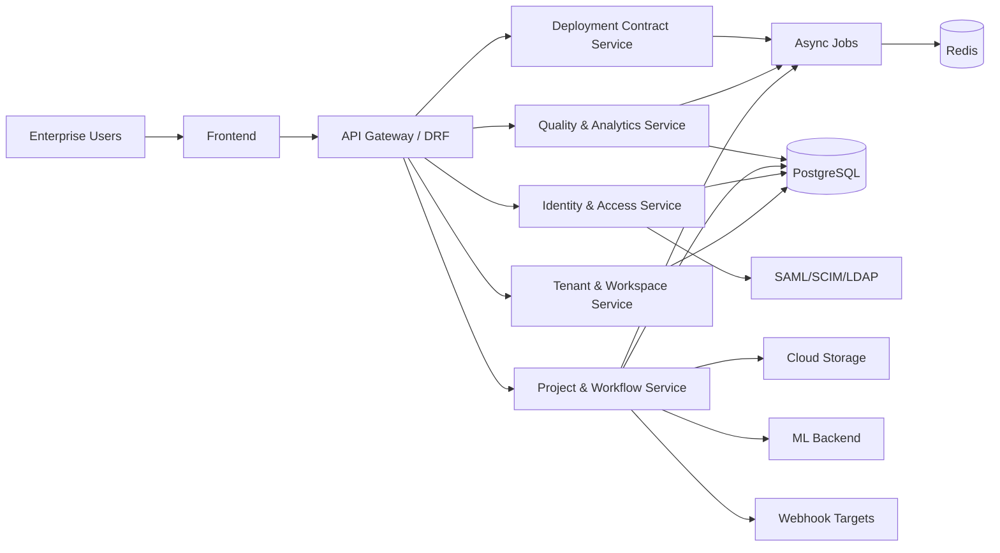
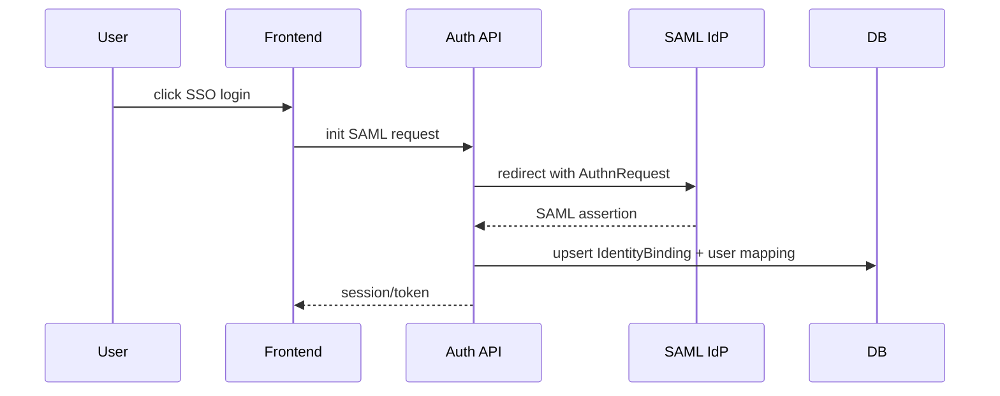

# Label Studio Enterprise 详细设计文档（SDD）

## 1. 文档信息
- 文档名称：Label Studio Enterprise 详细设计文档
- 关联需求文档：`docs/PRD/PRD_label_studio_enterprise_reverse.md`
- 适用仓库：`label-studio`
- 文档版本：`v1.0`
- 编写日期：`2026-04-01`
- 目标读者：架构师、后端工程师、前端工程师、测试工程师、运维工程师

## 2. 设计目标与原则

### 2.1 设计目标
1. 将企业版 PRD 中 `ENT-FR-001~030` 与 `ENT-DEP-001~006` 落地为可实现、可测试、可运维的工程方案。
2. 构建企业级“多租户隔离 + 身份集成 + 权限治理 + 质量闭环 + 高可用部署”能力。
3. 为后续 Codex 开发提供清晰模块边界、接口契约、配置契约和异常处理策略。
4. 建立企业版配置和部署的标准化模板，降低环境差异导致的交付风险。

### 2.2 设计原则
1. 租户隔离优先：组织边界是所有资源访问与统计口径的第一约束。
2. 权限默认拒绝：任何跨组织、跨工作空间、跨项目访问必须显式授权。
3. 配置即契约：Compose/Helm/Secret/TLS 参数必须具备可校验的最小必填集。
4. 可观测优先：关键链路必须具备日志、指标、追踪、审计四维可观测能力。
5. 失败可恢复：异步任务、外部依赖调用和部署流程都要具备重试与回滚路径。

## 3. 系统范围与边界

### 3.1 范围内
1. 多租户组织与工作空间体系。
2. RBAC、项目级角色、用户生命周期与身份集成（SAML/SCIM/LDAP）。
3. 企业安全能力（TLS、审计、网络访问控制、密钥管理）。
4. 智能标注与自动化（Active Learning、Prompt、插件、批量操作）。
5. 企业质量体系（审核流、一致性指标、低信任护栏、绩效看板）。
6. 企业部署体系（Kubernetes/Compose/HA/扩缩容/运维生命周期）。

### 3.2 范围外
1. 商务合同和收费体系实现细节（仅保留开关与能力边界）。
2. 超出 PRD 来源文档的功能推断。
3. 第三方基础设施本身实现（IdP、Redis、PostgreSQL、K8s 发行版）。

## 4. 总体架构设计

### 4.1 逻辑分层
1. 访问层：Web UI、REST API、Webhook 回调入口。
2. 业务层：组织/工作空间、项目与任务、质量与协作、部署配置管理。
3. 身份与安全层：RBAC、SAML/SCIM/LDAP、审计、安全策略。
4. 异步与自动化层：RQ 队列、Webhook、训练回流、导入导出作业。
5. 数据与集成层：PostgreSQL、Redis、对象存储、ML Backend、企业 IdP。
6. 部署与运维层：Compose 编排、Helm values、Secrets、TLS、可观测组件。

### 4.2 关键组件视图

### 4.3 模块映射建议
| 领域模块 | 职责 | 建议代码域 |
|---|---|---|
| Tenant/Workspace | 组织、工作空间、跨租户隔离 | `label_studio/organizations/*`, `label_studio/workspaces/*` |
| IAM/RBAC | 角色矩阵、项目角色、鉴权决策 | `label_studio/users/*`, `label_studio/security/*`, `label_studio/session_policy/*` |
| Identity Integration | SAML/SCIM/LDAP 对接与映射 | `label_studio/users/*`, `label_studio/integrations/identity/*` |
| Workflow Core | 项目、任务分发、批量标注、过滤排序 | `label_studio/projects/*`, `label_studio/tasks/*`, `label_studio/data_manager/*` |
| Quality/Analytics | 质量规则、一致性指标、看板聚合 | `label_studio/quality/*`, `label_studio/analytics/*` |
| Deployment Contract | Compose/Helm 配置契约、预检查、TLS 注入 | `label_studio/enterprise/deployment/*` |
| Audit & Observability | 审计日志、运行日志、指标与健康检查 | `label_studio/audit/*`, `label_studio/monitoring/*` |

## 5. 模块详细设计

### 5.1 租户与工作空间（ENT-FR-001/002/003）

#### 5.1.1 关键设计
1. 所有业务实体新增 `organization_id` 作为强制过滤条件。
2. 工作空间作为组织内二级隔离域，项目必须隶属于工作空间。
3. 跨组织访问在 API 入口进行统一拒绝，避免业务代码重复实现。

#### 5.1.2 接口契约
1. 组织上下文从当前用户会话或 token 映射获得。
2. 工作空间切换触发权限重载和缓存刷新。
3. 统计口径按组织聚合，不允许跨租户汇总。

#### 5.1.3 失败处理
1. 缺失组织上下文：返回 401/403。
2. 工作空间不存在或越权：返回 404/403。
3. 跨租户资源引用：拒绝并审计记录。

### 5.2 RBAC 与用户生命周期（ENT-FR-004/005/006）

#### 5.2.1 关键设计
1. 角色分层：组织角色 + 项目角色双轨并存。
2. 鉴权决策顺序：组织策略 -> 工作空间策略 -> 项目角色策略。
3. 停用用户保留历史产出，权限即刻撤销。

#### 5.2.2 权限矩阵实现建议
1. 将角色能力定义为策略表（声明式），避免散落 if/else。
2. API 权限检查使用统一 PolicyEvaluator。
3. 支持批量角色分配与批量成员关系操作。

### 5.3 身份集成（ENT-FR-007/008/009）

#### 5.3.1 SAML
1. 支持 SSO 登录、登出、证书轮换。
2. 属性映射支持 email/displayName/group。

#### 5.3.2 SCIM
1. 支持 Create/Update/Deactivate/Push Groups。
2. 保证幂等：同一外部标识重复推送不会产生重复用户。

#### 5.3.3 LDAP
1. 支持 LDAP 认证接入，本地继续维护角色授权。
2. 目录不可达时提供可观察错误和降级策略。

### 5.4 企业安全与审计（ENT-FR-010/011/012）

#### 5.4.1 安全基线
1. 数据面与控制面链路支持 TLS。
2. 审计日志覆盖关键操作：权限变更、配置变更、成员变更、部署变更。
3. 存储访问支持企业级凭据模式（IAM Role/WIF）。

#### 5.4.2 审计模型
- `audit_event_id`, `organization_id`, `actor_id`, `action`, `resource_type`, `resource_id`, `before`, `after`, `status`, `timestamp`, `trace_id`。

### 5.5 标注工作流与自动化（ENT-FR-013~016, 021~024）

#### 5.5.1 任务分配引擎
1. 输入：任务池、角色、重叠策略、锁策略、skip 队列策略。
2. 输出：可领取任务 + 锁信息 + 分发原因。
3. 规则执行顺序：资格过滤 -> 锁过滤 -> 重叠检查 -> 采样策略排序 -> 最终分配。

#### 5.5.2 批量标注
1. 由 Data Manager 选中集合驱动，执行批量写入。
2. 批量动作必须记录操作人、操作条件、影响任务数。

#### 5.5.3 Active Learning
1. 标注提交后触发 webhook 到 ML Backend。
2. 回写预测时带模型版本，避免污染历史预测。

#### 5.5.4 插件与 Prompt
1. 插件事件：task_load、annotation_change、annotation_submit。
2. Prompt 输出可作为预标注或生成任务输入。

### 5.6 质量与分析（ENT-FR-017~020）

#### 5.6.1 质量规则引擎
1. 自动校验规则（字段完整、标签合法、结构一致）。
2. 审核流状态机：`pending -> accepted/rejected -> rework`。

#### 5.6.2 一致性指标
1. 指标按任务类型选择：IoU、编辑距离、F1 等。
2. 支持任务级、项目级聚合与趋势统计。

#### 5.6.3 低信任护栏
1. 规则触发自动暂停。
2. 用户级标注上限控制。

### 5.7 协作能力（ENT-FR-025/026）
1. 评论线程锚定到任务/区域/字段。
2. 深链包含上下文定位参数，访问前先鉴权。

## 6. 部署与运维详细设计（ENT-FR-027/028, ENT-DEP-001~006）

### 6.1 Docker Compose 契约

#### 6.1.1 服务拓扑
1. `nginx`：入口代理与 TLS 终止。
2. `app`：主应用（uWSGI）。
3. `rqworkers_low/default/high/critical`：队列分治执行。

#### 6.1.2 参数契约
1. 必填：`LICENSE`, `LABEL_STUDIO_HOST`, `POSTGRE_HOST`, `POSTGRE_PORT`, `POSTGRE_USER`, `POSTGRE_PASSWORD`, `POSTGRE_NAME`, `REDIS_LOCATION`。
2. 证书相关可选：`POSTGRE_SSL_MODE`, `POSTGRE_SSLROOTCERT`, `REDIS_SSL_CA_CERTS` 等。
3. 所有敏感配置通过 `env.list` 或 Secret 文件注入。

#### 6.1.3 启动前检查
1. 检查 license 文件挂载存在且可读。
2. 检查 PostgreSQL/Redis 连接串可解析。
3. 检查关键环境变量不为空。

### 6.2 Kubernetes + Helm 契约

#### 6.2.1 最小 values 集合
1. `global.image.repository/tag/pullPolicy`
2. `global.imagePullSecrets`
3. `global.pgConfig.*`
4. `global.redisConfig.*`
5. `enterprise.enabled=true`
6. `enterprise.enterpriseLicense.secretName/secretKey`
7. `app.replicas`, `app.ingress.*`
8. `rqworker.queues.*.replicas`

#### 6.2.2 外部依赖策略
1. 使用外部 PostgreSQL/Redis 时显式设置 `postgresql.enabled=false`, `redis.enabled=false`。
2. 凭据来自 K8s Secret，不在 values 中明文保存。

### 6.3 Secret/TLS 管理
1. 镜像拉取 Secret：`heartex-pull-key`（示例）。
2. License Secret：`lse-license`（示例）。
3. TLS Secret（PostgreSQL/Redis）键位统一：`ca.crt`, `client.crt`, `client.key`。
4. PostgreSQL SSL 模式支持 `verify-ca` 与 `verify-full`。

### 6.4 扩缩容与容量规划
1. `app.replicas` 与 `rqworker.queues.*.replicas` 独立扩缩容。
2. 默认建议：`default` 队列副本高于其余队列。
3. 生产环境副本数应不低于可用区数量。

### 6.5 运维生命周期
1. 安装：`helm install <RELEASE_NAME> heartex/label-studio -f ls-values.yaml`
2. 重启：`kubectl rollout restart deployment/<RELEASE_NAME>-ls-rqworker` 与 `...-ls-app`
3. 健康验证：`kubectl get pods` + `/health` + `/version`
4. 卸载：`helm delete <RELEASE_NAME>`

## 7. 数据模型设计

### 7.1 关键实体（增量）
| 实体 | 关键字段 | 说明 |
|---|---|---|
| Organization | `id`, `name`, `status` | 租户边界 |
| Workspace | `id`, `organization_id`, `name`, `owner_id` | 组织内项目域 |
| Membership | `user_id`, `organization_id`, `role` | 组织角色 |
| ProjectMembership | `user_id`, `project_id`, `project_role` | 项目级角色 |
| IdentityBinding | `provider`, `external_id`, `user_id`, `attributes` | SAML/SCIM/LDAP 映射 |
| AuditEvent | `organization_id`, `actor_id`, `action`, `resource`, `before`, `after` | 审计记录 |
| DeploymentProfile | `organization_id`, `mode`, `config_hash`, `status` | 部署配置快照 |

### 7.2 约束
1. 所有业务数据必须可追溯到 `organization_id`。
2. IdentityBinding 的 `provider + external_id` 唯一。
3. 审计日志写入失败不能阻断主业务，但必须告警。

## 8. 关键流程设计

### 8.1 SAML 登录流程

### 8.2 SCIM 供给流程
1. IdP 推送 user create/update/deactivate。
2. SCIM API 执行幂等 upsert。
3. 同步组织/工作空间/项目成员关系。
4. 记录审计事件。

### 8.3 自动分发流程
1. 标注员请求下一个任务。
2. 任务分配引擎应用 overlap/lock/skip/sampling 规则。
3. 返回任务并写入锁。
4. 标注提交更新统计并触发（可选）模型回流。

### 8.4 部署预检查流程
1. 解析 Compose/Helm 配置。
2. 校验必填参数、Secret 引用、证书键位。
3. 失败则阻断部署并输出结构化错误。
4. 通过后执行安装与健康检查。

## 9. 异常处理与一致性

### 9.1 异常分类
1. 配置异常：缺必填参数、Secret 不存在、证书不匹配。
2. 身份异常：断言无效、SCIM 字段冲突、LDAP 不可达。
3. 权限异常：角色不足、跨组织访问。
4. 运行异常：队列堆积、外部依赖超时、回调失败。

### 9.2 一致性策略
1. 外部集成采用幂等键与重试策略。
2. 关键状态更新采用事务边界和补偿任务。
3. 统计聚合采用“准实时 + 重算”双路径。

## 10. 非功能设计

### 10.1 性能
1. 大规模任务查询采用分页、索引、按需聚合。
2. 异步任务按队列优先级拆分，避免互相阻塞。

### 10.2 安全
1. 默认启用认证鉴权。
2. 生产建议启用 `SSRF_PROTECTION_ENABLED=true`。
3. 敏感配置全部由 Secret 注入。

### 10.3 可观测
1. 指标：请求延迟、队列长度、任务吞吐、失败率。
2. 日志：结构化日志，统一 trace_id。
3. 审计：权限、配置、成员、部署动作全量留痕。

## 11. 面向 Codex 的实现拆分建议

### 11.1 任务包 A：身份与权限
1. 实现组织/工作空间上下文拦截器。
2. 实现策略化 RBAC 决策器。
3. 实现 SAML/SCIM/LDAP 适配层与审计事件。

### 11.2 任务包 B：流程与质量
1. 实现自动分发规则引擎（overlap/lock/skip/sampling）。
2. 实现质量规则引擎与一致性指标接口。
3. 实现评论深链与通知权限控制。

### 11.3 任务包 C：部署契约
1. 生成 Compose 模板与参数校验器。
2. 生成 Helm 最小值模板与 Secret/TLS 注入。
3. 实现安装/重启/卸载脚本与健康检查脚本。

### 11.4 任务包 D：测试与门禁
1. 建立 `ENT-FR` 与 `ENT-DEP` 自动化回归套件。
2. 构建部署链路的 CI 验证作业（Compose + K8s 双环境）。

## 12. 交付与验收
1. 代码层需满足 PRD 的 P0/P1 需求优先级。
2. 部署子需求 `ENT-DEP-001~004` 必须完成双环境验收。
3. 交付文档需包含配置示例、失败排查、回滚步骤。
