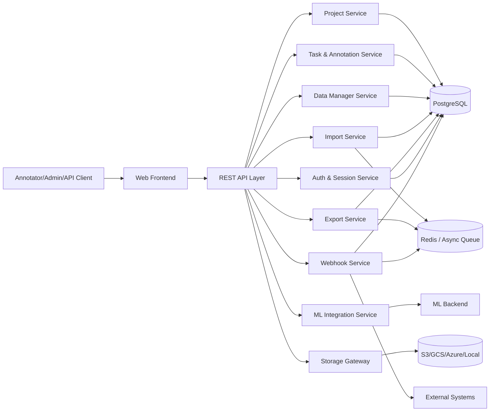
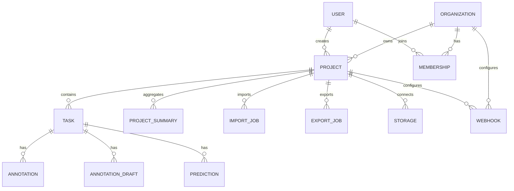
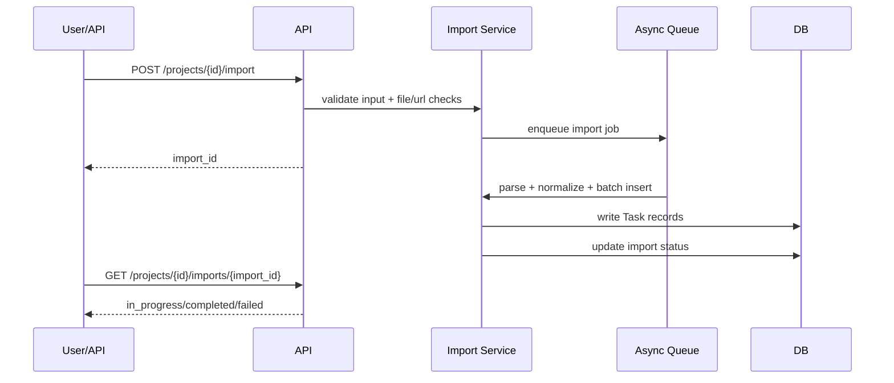

# Label Studio OSS 详细设计文档（SDD）

## 1. 文档信息
- 文档名称：Label Studio OSS 详细设计文档
- 关联需求文档：`docs/PRD/PRD_label_studio_oss_reverse.md`
- 适用仓库：`label-studio`
- 文档版本：`v1.0`
- 编写日期：`2026-04-01`
- 目标读者：架构师、后端工程师、前端工程师、测试工程师、运维工程师

## 2. 设计目标与原则

### 2.1 设计目标
1. 将 PRD 中 FR-01 ~ FR-20 落地为可实现、可测试、可运维的工程方案。
2. 保证“项目创建 -> 数据导入 -> 标注执行 -> 质量控制 -> 导出集成”的主链路稳定。
3. 支持多模态、多角色协作、多外部系统接入，并保持 OSS 场景下的可扩展性。
4. 在容量增长时，通过异步化、缓存、分页和批处理维持系统性能。

### 2.2 设计原则
1. 单一职责：按业务域拆分模块，避免跨域强耦合。
2. 接口优先：以 REST API 和内部服务接口定义边界。
3. 可观测优先：关键操作必须可追踪、可计量、可告警。
4. 安全默认开启：认证、权限、输入校验、外部访问防护为默认策略。
5. 扩展优先于重写：通过 Provider/Action/Backend 抽象扩展能力。

## 3. 系统范围与边界

### 3.1 范围内
1. 组织与用户管理。
2. 项目生命周期与标注配置管理。
3. 数据导入、数据管理、标注执行与任务分配。
4. 质量统计、模型联动、存储接入、导出、Webhook。
5. 认证会话、审计、健康检查与基础可观测。

### 3.2 范围外
1. 企业版专属高级权限治理能力。
2. 全量工作流编排系统（仅提供动作和异步作业机制）。

## 4. 总体架构设计

### 4.1 逻辑分层
1. 表现层：前端页面与交互路由（`web/apps/labelstudio/src/pages/*`）。
2. API 层：Django + DRF 提供统一 REST 接口。
3. 领域服务层：项目、任务、导入导出、ML、存储、Webhook 等业务服务。
4. 数据层：PostgreSQL（核心业务数据）+ Redis（队列/缓存/任务调度场景）。
5. 集成层：对象存储、ML Backend、外部 Webhook 消费端。

### 4.2 模块映射
- 组织与用户：`label_studio/organizations/*`、`label_studio/users/*`
- 项目管理：`label_studio/projects/*`
- 任务与标注：`label_studio/tasks/*`
- 数据管理：`label_studio/data_manager/*`
- 导入导出：`label_studio/data_import/*`、`label_studio/data_export/*`
- 存储：`label_studio/io_storages/*`
- 机器学习：`label_studio/ml/*`
- 认证策略：`label_studio/session_policy/*`、`label_studio/jwt_auth/*`
- 状态机与审计：`label_studio/fsm/*`
- 事件通知：`label_studio/webhooks/*`

### 4.3 高层组件图

## 5. 模块详细设计

### 5.1 模块清单与边界

| 模块 | 核心职责 | 关键代码域 | 主要接口能力 | 关键约束 |
|---|---|---|---|---|
| 组织与用户模块 | 组织、成员、账号、Token、热键配置 | `organizations/*`, `users/*` | 组织增删改查、成员管理、whoami、token 重置 | 组织隔离、不可删除自己 |
| 项目配置模块 | 项目生命周期、标注配置、采样/重叠策略 | `projects/*` | 项目 CRUD、label config 校验、sample task | 项目名长度、配置合法性 |
| 数据导入模块 | JSON/文件/URL 导入、reimport、状态追踪 | `data_import/*` | import/reimport/status | 文件大小、任务量、格式白名单 |
| 数据管理模块 | 任务查询、筛选排序、视图管理、批量动作 | `data_manager/*` | views、tasks、actions | 分页上限、查询性能 |
| 标注执行模块 | next task 分配、锁机制、草稿/标注/预测 CRUD | `tasks/*` | next、annotations、drafts、predictions | 并发冲突控制、skip 策略 |
| 质量统计模块 | summary 聚合、一致性统计、缓存刷新 | `projects/*`, `tasks/*` | summary/reset/agreement | 统计准确性与可回补 |
| ML 集成模块 | backend 管理、训练触发、交互式预测 | `ml/*` | ml CRUD、train、interactive-annotating | 模型可用性与超时治理 |
| 存储网关模块 | source/target 存储统一接入与同步 | `io_storages/*` | validate/sync/files/resolve | 凭证安全、URI 合法性 |
| 数据导出模块 | 同步导出与异步快照导出 | `data_export/*` | export、exports 状态、下载 | 大数据量导出稳定性 |
| Webhook 模块 | 事件订阅、投递、重试、配置管理 | `webhooks/*` | webhooks CRUD/info | 至少一次投递、幂等建议 |
| 安全与会话模块 | JWT、Session Policy、API Token 管理 | `jwt_auth/*`, `session_policy/*` | session-policy、jwt settings、token | 认证一致性、会话过期策略 |
| FSM 与审计模块 | 实体状态历史、手动迁移能力 | `fsm/*` | history、transition | 状态迁移合法性 |

### 5.2 组织与用户模块
1. 采用“用户 + active_organization”作为业务隔离主键。
2. 所有项目级查询基于当前组织过滤，避免跨租户读取。
3. 账号侧统一提供 whoami、token 生命周期管理能力。

### 5.3 项目配置模块
1. `Project` 作为任务容器，承载 `label_config`、采样策略、skip 策略、模型配置。
2. `label_config` 采用 XML，服务端进行解析、校验、缓存（`parsed_label_config`）。
3. 配置更新触发兼容性校验，防止历史任务结果结构失配。

### 5.4 数据导入模块
1. 接入方式：JSON body、文件上传、URL 拉取。
2. 解析流程：输入校验 -> 格式解析 -> 字段归一 -> 批量写入任务。
3. 异步模式：导入任务与状态对象分离，前端轮询状态。
4. 限流策略：任务数量上限、上传大小上限、扩展名白名单控制。

### 5.5 数据管理与标注执行模块
1. Data Manager 提供视图保存、过滤、排序、统计聚合。
2. 任务分配（`next`）按锁、采样、skip queue、overlap 进行候选筛选。
3. 标注执行支持 annotation、draft、prediction 的独立生命周期。
4. Task Lock + overlap 降低并发冲突与重复劳动。

### 5.6 质量统计模块
1. 项目级 summary 聚合任务量、标注量、预测量、标签分布等统计。
2. 任务级 agreement 计算一致性指标，用于质检和回溯。
3. 提供 reset 能力，在数据修复后触发重算。

### 5.7 ML 集成模块
1. 对接外部 ML Backend，支持健康检查和配置校验。
2. 支持训练触发、测试预测、交互式预测。
3. 与项目配置联动：模型版本选择、预标注展示、提交后训练阈值。

### 5.8 存储网关模块
1. 统一 Source/Target 存储抽象，屏蔽各 Provider 差异。
2. 支持连接验证、文件浏览、同步、URI 解析与访问签名。
3. 存储错误按 Provider 分类处理并返回可诊断信息。

### 5.9 数据导出模块
1. 同步导出用于小数据量快速获取。
2. 异步导出用于大数据量快照与格式转换。
3. 导出状态机：`created -> in_progress -> completed/failed`。

### 5.10 Webhook 模块
1. 支持组织级与项目级订阅。
2. 按动作类型过滤事件，支持 header 与 payload 策略。
3. 采用异步投递机制，隔离主交易链路。

### 5.11 安全、会话与审计模块
1. 认证机制并存：Session、JWT、API Token。
2. 组织级 Session Policy 控制会话过期行为。
3. FSM 历史记录用于审计、排障、合规追踪。

## 6. 数据模型设计

### 6.1 核心实体关系

### 6.2 关键实体字段与索引（节选）

| 实体 | 关键字段 | 说明 | 索引/约束要点 |
|---|---|---|---|
| `Project` | `title`, `organization`, `label_config`, `parsed_label_config`, `show_collab_predictions`, `skip_queue`, `model_version` | 项目配置与策略中心 | 标题长度校验、组织隔离 |
| `Task` | `data`, `meta`, `project`, `is_labeled`, `overlap`, `inner_id`, `total_annotations`, `total_predictions` | 标注工作单元 | `(project,is_labeled)`, `(project,inner_id)`, `(project,id)` 索引 |
| `Annotation` | `task`, `project`, `completed_by`, `result`, `was_cancelled`, `ground_truth` | 人工标注结果 | Ground Truth 唯一性策略 |
| `AnnotationDraft` | `task`, `created_by`, `result` | 草稿态结果 | 草稿转标注能力 |
| `Prediction` | `task`, `project`, `model_version`, `result` | 模型预测结果 | 按 task/project/model_version 过滤 |
| `Import/Reimport` | `project`, `status`, `created_by`, `error` | 导入异步作业 | 状态轮询与失败可见 |
| `Export` | `project`, `status`, `serialized_filename` | 导出异步作业 | 状态跟踪与下载 |

## 7. 关键流程设计

### 7.1 项目创建与配置校验流程
1. 创建项目并保存基础元数据。
2. 提交 `label_config` 后执行语法与语义校验。
3. 校验通过后写入解析缓存，生成 sample task 用于预览。

### 7.2 导入流程

### 7.3 任务分配与标注流程
1. 标注员请求 `next task`。
2. 服务端按锁、overlap、采样策略、skip 队列筛选候选任务。
3. 返回任务并设置短时锁，防止同任务被并发领取。
4. 标注提交时更新任务计数与项目聚合统计。

### 7.4 模型联动流程
1. 项目启用预标注与模型版本。
2. 任务加载时按配置获取预测结果。
3. 标注提交后满足阈值可触发训练任务。
4. 新模型版本写回，供后续任务预标注使用。

### 7.5 导出流程
1. 小数据量场景直接同步导出。
2. 大数据量场景创建异步导出任务。
3. 导出结果持久化并提供下载地址。

## 8. 异常处理与一致性设计

### 8.1 异常分类
1. 输入异常：参数缺失、格式不合法、扩展名不支持。
2. 业务异常：权限不足、任务不可标注、状态迁移非法。
3. 外部依赖异常：存储连接失败、ML 超时、Webhook 目标不可达。
4. 系统异常：数据库冲突、队列积压、服务不可用。

### 8.2 一致性策略
1. 聚合统计采用“实时更新 + 异步补偿重算”双机制。
2. 关键异步作业提供明确状态机与错误明细。
3. 并发冲突通过任务锁和事务边界控制。
4. Webhook 按至少一次语义投递，消费端需支持幂等。

## 9. 性能与容量设计

### 9.1 查询与分页
1. 项目、任务、成员均采用分页访问，防止一次性全量拉取。
2. 任务列表查询依赖组合索引与筛选条件下推。

### 9.2 批处理与异步化
1. 导入、导出、批量动作在异步通道执行，降低 API 延迟。
2. 大文件解析采用流式/分批策略，控制峰值内存。

### 9.3 缓存策略
1. `ProjectSummary` 作为聚合缓存层。
2. 通过 reset 接口触发重算，平衡实时性与计算成本。

## 10. 安全设计

1. 认证：默认 `IsAuthenticated`，并叠加对象级权限校验。
2. 鉴权：基于组织上下文做数据隔离，不允许跨组织访问。
3. 输入安全：上传扩展名白名单、大小限制、URL 校验与 SSRF 防护。
4. 凭证安全：存储与外部集成凭证按服务端安全配置管理。
5. 会话安全：Session Policy、JWT 刷新与失效策略协同。

## 11. 可观测与运维设计

1. 健康检查：`/health/`。
2. 版本识别：`/api/version/`。
3. API Schema：`/docs/api/schema/*`。
4. 指标建议：导入成功率、导出成功率、Webhook 成功率、任务分配延迟。
5. 告警建议：异步任务失败率阈值、队列积压阈值、外部依赖超时阈值。

## 12. 测试设计

### 12.1 单元测试
1. `label_config` 解析与校验。
2. `next task` 分配策略（含 skip queue 分支）。
3. 导入解析器（多格式、多错误输入）。

### 12.2 集成测试
1. 导入 -> 标注 -> 导出端到端流程。
2. ML backend 接入与预测回填流程。
3. Source/Target 存储同步链路。

### 12.3 回归与性能测试
1. 大规模任务集分页与筛选压测。
2. 导入/导出批量任务稳定性测试。
3. Webhook 重试与幂等行为验证。

## 13. 关键技术特性（可用于汇报）

1. 多模态统一标注架构：文本、图像、音频、视频等任务统一在同一项目模型下治理。
2. XML 驱动的标注界面引擎：`label_config` 可配置化，支持快速适配新任务。
3. 动态任务分配算法：结合锁、采样、overlap、skip queue，实现高并发下的公平与效率平衡。
4. 预标注协同闭环：模型预测接入标注流，人工修正反哺模型训练。
5. 异步数据管道：导入、导出、批处理动作异步化，保障大规模数据下的响应稳定。
6. Data Manager 动作扩展机制：批量操作通过动作注册机制扩展，降低二次开发成本。
7. 统一存储抽象层：S3/GCS/Azure/Local 等 provider 统一接口接入，便于混合云场景。
8. 统计缓存与补偿重算：`ProjectSummary` 降低在线聚合开销，并支持一致性修复。
9. 可追踪状态机审计：FSM 历史与手动迁移能力提高问题定位与合规可解释性。
10. 多认证机制并存：Session、JWT、API Token 适配 Web 交互和系统集成双场景。
11. Webhook 事件集成能力：按动作订阅与异步投递支持外部系统自动化联动。
12. 可运维入口标准化：健康、版本、Schema、指标挂载点齐备，便于平台化运维。

## 14. 风险与演进建议

1. 风险：OSS 与企业能力边界易引发预期偏差。
2. 建议：对外发布时标注“能力矩阵”并固定版本口径。
3. 风险：多外部依赖（存储、ML、Webhook）导致故障域扩大。
4. 建议：增加熔断、重试退避与依赖降级策略。
5. 风险：任务量增长后查询和聚合压力显著上升。
6. 建议：持续优化索引、异步化与冷热数据治理策略。

## 15. 实施就绪结论

该设计在保持现有 OSS 架构风格的前提下，完成了对 FR-01 ~ FR-20 的工程化映射，并给出了模块边界、数据结构、关键流程、NFR 落地路径和测试策略。可作为后续实施计划与里程碑拆解的输入基线。
