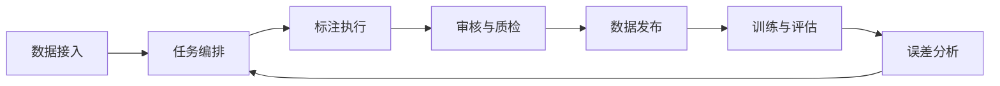
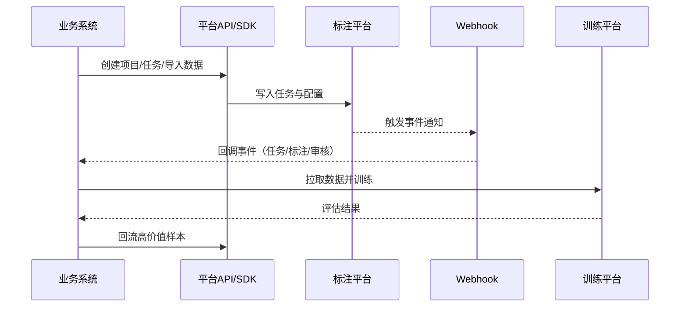
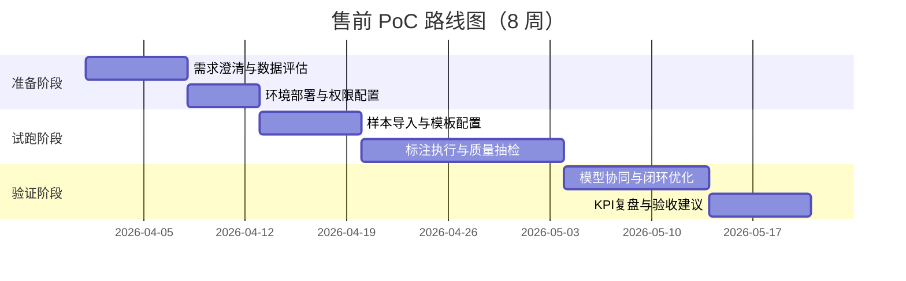

# 封面页

**智能数据标注平台产品白皮书（客户售前版）**  
版本：V1.3（Guide增强版）  
发布日期：2026 年 4 月 1 日  
文件属性：售前资料 / 客户沟通版  
建议密级：对外受控  
提交对象：客户业务负责人、技术负责人、采购与安全合规团队

编制单位：售前解决方案中心  
联系人：________________  
邮箱：________________  
电话：________________

---

# 目录页

1. 项目背景与客户价值  
2. 行业痛点与目标场景  
3. 解决方案总览  
4. 快速上手路径（9步落地）  
5. 部署选型与容量规划  
6. 核心产品能力（Guide实践细化）  
7. 安全合规与组织治理  
8. API / SDK / Webhook 集成策略  
9. PoC 实施方法与里程碑  
10. ROI 评估模型与验收口径  
11. 合作建议与下一步  
12. 统一术语页  
13. 附录 A：指标口径  
14. 附录 B：实施清单  
15. 参考来源

---

# 1. 项目背景与客户价值

在企业 AI 落地中，模型可得性已不再是主要障碍，数据质量与数据供给效率正在成为决定交付速度和业务收益的核心变量。  
智能数据标注平台通过“数据接入—任务分发—标注执行—审核质检—模型回流—结果导出”的闭环，帮助客户构建可持续的数据生产系统。

客户可获得的核心价值：
1. 更快：缩短训练数据交付周期与模型迭代周期。  
2. 更稳：统一标注标准与审核机制，降低质量波动。  
3. 更省：通过预标注和流程优化减少人工返工。  
4. 更可管：满足权限控制、审计追踪与数据治理要求。

---

# 2. 行业痛点与目标场景

## 2.1 常见痛点

1. 多模态数据分散，工具链不统一，协作效率低。  
2. 标注标准依赖个人经验，返工率高、质量不稳定。  
3. 模型预测与人工流程脱节，数据闭环不完整。  
4. 合规审查阶段缺少可追溯证据链。  
5. 试点可跑通但规模化时成本和组织复杂度上升。

## 2.2 目标场景

1. 文本场景：分类、抽取、问答、对话质检。  
2. 视觉场景：检测、分割、关键点、视频事件。  
3. 音频场景：转写、说话人、意图、情绪识别。  
4. 行业场景：金融风控、医疗文本、内容审核、工业质检。

---

# 3. 解决方案总览

平台方案分为四层：
1. 数据层：样本接入、存储与版本化管理。  
2. 流程层：任务分发、进度控制、审核与返修。  
3. 质量层：一致性评估、抽检、争议样本处理。  
4. 集成层：模型服务、训练平台、导出与报表系统。

---

# 4. 快速上手路径（9步落地）

基于官方 Quick Start 的售前最短闭环建议：

1. 安装并启动平台（`pip` / `brew` / `docker` / 源码部署）。  
2. 打开服务地址（示例：`http://localhost:8080`）。  
3. 注册并完成初始化登录。  
4. 创建项目并明确业务目标。  
5. 配置项目基础信息（Project Name）。  
6. 导入数据（Data Import）。  
7. 配置标注模板（Labeling Setup）。  
8. 保存并创建首批任务。  
9. 启动标注与结果校验。

售前落地建议：
1. 将 9 步压缩为“2 小时演示 + 3 天试跑 + 2 周复盘”。  
2. 首批样本建议 500~2000 条，覆盖高频和疑难样本。  
3. 首周即建立抽检规则、返工机制、问题分类。

---

# 5. 部署选型与容量规划

## 5.1 部署选型

| 方案 | 适用阶段 | 特征 | 建议 |
|---|---|---|---|
| 本地安装（pip/brew） | 个人试用、售前演示 | 快速启动、门槛低 | 用于演示与方案验证 |
| Docker 部署 | 团队 PoC | 环境一致、易复制 | 用于 2~8 周 PoC |
| 源码部署 | 二次开发、平台嵌入 | 可定制、可扩展 | 用于深度集成 |
| 托管云服务 | 快速上线 | 运维负担低 | 用于轻运维团队 |
| 企业私有化 | 高合规行业 | 数据主权可控 | 用于金融、医疗、政企 |

## 5.2 容量与性能建议（Guide实践）

1. 小规模试点可使用默认数据库进行快速验证。  
2. 生产环境建议使用 PostgreSQL。  
3. 当单项目任务或标注规模接近/超过 100,000 时，应优先进行项目拆分、分批处理和存储优化。  
4. 大规模媒体数据建议使用对象存储 + URL 引用，而不是通过 UI 直接上传原始媒体。  
5. 高频同步场景建议结合云存储同步策略，避免高并发下的导入瓶颈。

## 5.3 版本能力矩阵（售前沟通重点）

| 能力项 | 社区开源版 | 托管/企业增强版 |
|---|---|---|
| 基础标注与模板 | 支持 | 支持 |
| 团队管理与角色分工 | 基础 | 增强（RBAC/队列） |
| 审核与质量工作流 | 基础 | 增强（一致性/共识/审核队列） |
| 自动预标注 | 可集成 | 增强（工作流级） |
| 安全能力 | 基础 | 增强（SSO/SCIM/审计） |
| 高级界面扩展 | 支持 | 支持（企业能力更完整） |

---

# 6. 核心产品能力（Guide实践细化）

## 6.1 数据接入与存储

1. 支持文件导入、云存储连接、批次导入。  
2. 支持源存储（Source Storage）和目标存储（Target Storage）分离策略。  
3. 支持手动或计划式同步，适配持续数据流。

## 6.2 项目配置与模板

1. 标准项目创建流程由三个页签构成：`Project Name`、`Data Import`、`Labeling Setup`。  
2. 支持从预置模板快速启动，也支持自定义标签配置。  
3. 支持按业务语义设计标签体系和说明文本，降低标注歧义。

## 6.3 标注执行与质量治理

1. 支持任务分配、进度追踪、返工闭环。  
2. 支持审核和抽检策略，覆盖“通过/驳回/返修”流程。  
3. 支持争议样本处理和质量问题归因沉淀。

## 6.4 数据管理与导出

1. 支持数据过滤、排序、子集管理。  
2. 支持按业务条件导出结果数据。  
3. 支持与下游训练评估系统衔接，形成闭环。

## 6.5 机器学习协同

1. 支持模型预测预标注。  
2. 支持人工修正后回流优化策略。  
3. 支持通过 ML Backend 进行在线推理与辅助标注。

---

# 7. 安全合规与组织治理

## 7.1 安全基线建议（生产环境）

1. 使用 HTTPS/TLS 暴露服务入口。  
2. 通过反向代理控制暴露端口和访问边界。  
3. 启用 SSRF 防护配置（生产建议开启）。  
4. 对 API Token、Webhook 地址、存储凭据实施最小权限管理。  
5. 建立操作日志留痕与审计机制。

## 7.2 组织治理建议

1. 明确管理员、标注员、审核员角色边界。  
2. 建立标准样本库和审核准则，降低团队内偏差。  
3. 公开注册策略按安全要求配置，生产环境建议关闭匿名/无链接注册。  
4. 按周复盘效率、质量、返工、异常与风险。

---

# 8. API / SDK / Webhook 集成策略

## 8.1 API 与 SDK

1. 建议统一使用个人访问令牌（PAT）或组织标准令牌策略。  
2. 建议通过 SDK 封装项目创建、任务导入、结果导出等高频操作。  
3. 建议将平台 API 与企业 IAM、审计体系联动。

## 8.2 Webhook

1. 适用于事件驱动集成（如标注完成后触发下游流程）。  
2. 建议设置幂等处理、失败告警与重试策略（在业务侧实现）。  
3. 建议对回调超时、签名校验和来源白名单进行统一治理。

---

# 9. PoC 实施方法与里程碑

## 9.1 标准 PoC 周期（6~8 周）

## 9.2 PoC 验收建议

1. 效率目标：单位样本时长下降。  
2. 质量目标：首次通过率提升、返工率下降。  
3. 业务目标：交付周期缩短、上线节奏加快。  
4. 治理目标：日志可追溯、权限可核验。

---

# 10. ROI 评估模型与验收口径

## 10.1 核心公式

1. 效率提升率 = （上线后单位时间产出 - 基线产出）/ 基线产出。  
2. 返工下降率 = （基线返工率 - 当前返工率）/ 基线返工率。  
3. 年化 ROI = （年化收益 - 年化投入）/ 年化投入。

## 10.2 建议 KPI

1. 平均标注时长（秒/样本）。  
2. 单人日产能（样本/人天）。  
3. 首次通过率（%）。  
4. 返工率（%）。  
5. 数据交付周期（天）。  
6. 低置信样本复核命中率（%）。

---

# 11. 合作建议与下一步

1. 先行启动 1~2 个高价值场景 PoC。  
2. 明确双方 KPI、里程碑和责任人。  
3. PoC 通过后分阶段扩容至多业务线。  
4. 同步推进组织治理和质量标准化建设。  
5. 建立季度共创机制，持续优化效率与质量。

---

# 12. 统一术语页

| 术语 | 定义 | 在客户项目中的用途 |
|---|---|---|
| 数据标注 | 对样本内容进行结构化语义标记 | 训练/评估数据生产基础 |
| 标注模板 | 可复用的任务配置规则 | 提高新场景上线效率 |
| 预标注 | 模型先生成初始标注建议 | 降低纯人工标注工作量 |
| 审核流 | 标注结果复核和反馈流程 | 控制质量与误差 |
| 一致性 | 多标注员输出的符合程度 | 评估标注规范稳定性 |
| 返工率 | 被驳回并需重新标注的比例 | 反映流程效率与质量 |
| 数据闭环 | 标注结果回流模型形成迭代 | 持续提升模型效果 |
| RBAC | 基于角色的访问控制 | 支撑多角色协作治理 |
| PoC | 概念验证项目 | 降低正式采购决策风险 |
| PAT | Personal Access Token | API 集成授权方式 |

---

# 13. 附录 A：指标口径

## A.1 效率类指标

1. 平均标注时长（秒/样本）= 总标注耗时 / 样本数。  
2. 单人日产能（样本/人天）= 当日产出样本数 / 投入人天。  
3. 交付周期（天）= 任务创建到验收完成所需自然日。

## A.2 质量类指标

1. 首次通过率 = 一审通过样本 / 审核样本总数。  
2. 返工率 = 被驳回样本 / 标注样本总数。  
3. 一致性得分 = 双盲样本一致数量 / 双盲样本总数。  
4. 低置信复核命中率 = 低置信样本中被确认问题样本 / 低置信样本总数。

## A.3 价值类指标

1. 成本下降率 = （基线成本 - 当前成本）/ 基线成本。  
2. 周期缩短率 = （基线周期 - 当前周期）/ 基线周期。  
3. 模型收益项：效果提升、上线时效、回归成本下降。

---

# 14. 附录 B：实施清单

## B.1 项目启动清单

1. 明确业务目标、数据范围、项目边界。  
2. 明确组织角色与沟通机制。  
3. 明确验收 KPI 与评估窗口。  
4. 完成数据和安全前置评估。

## B.2 PoC 执行清单

1. 完成环境部署（建议 Docker）。  
2. 完成模板配置与样本抽样。  
3. 完成角色授权与流程联调。  
4. 完成质量抽检机制设置。  
5. 输出周报与阶段复盘结论。

## B.3 正式上线清单

1. 完成生产环境部署与监控告警。  
2. 完成操作手册与培训交付。  
3. 完成 SLA 与支持机制确认。  
4. 完成季度优化计划与责任人绑定。

---

# 15. 参考来源

1. Label Studio Guide 首页：`https://labelstud.io/guide/`  
2. Quick Start：`https://labelstud.io/guide/quick_start.html`  
3. Project setup：`https://labelstud.io/guide/setup_project.html`  
4. Install：`https://labelstud.io/guide/install.html`  
5. Cloud & External Storage：`https://labelstud.io/guide/storage.html`  
6. Import tasks：`https://labelstud.io/guide/tasks.html`  
7. Export annotations：`https://labelstud.io/guide/export.html`  
8. Integrate ML models：`https://labelstud.io/guide/ml.html`  
9. Webhooks：`https://labelstud.io/guide/webhooks.html`  
10. Manage users：`https://labelstud.io/guide/signup.html`  
11. API & SDK：`https://labelstud.io/guide/api.html`  
12. Security guidance：`https://labelstud.io/guide/security.html`  
13. Edition comparison：`https://labelstud.io/guide/label_studio_compare.html`
