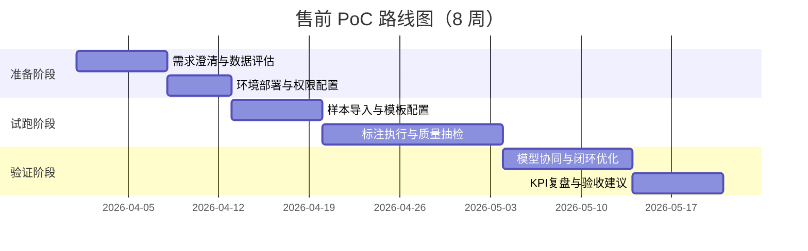

# 封面页

**智能数据标注平台产品白皮书（客户售前版）**  
版本：V2.0（细化版）  
发布日期：2026 年 4 月 1 日  
文件属性：售前资料 / 客户沟通版  
建议密级：对外受控  
提交对象：客户业务负责人、技术负责人、采购与安全合规团队

编制单位：售前解决方案中心  
联系人：________________  
邮箱：________________  
电话：________________

---

# 目录页

1. 项目背景与客户价值  
2. 行业痛点与目标场景  
3. 解决方案总览  
4. 快速上手路径（9 步落地）  
5. 部署选型与版本能力矩阵  
6. 核心产品能力（细化）  
7. 安全合规与组织治理  
8. PoC 实施方法与里程碑  
9. ROI 评估模型与验收口径  
10. 合作建议与下一步  
11. 统一术语页  
12. 附录 A：指标口径  
13. 附录 B：实施清单

---

# 1. 项目背景与客户价值

在企业 AI 落地中，模型能力差异正逐步收敛，数据质量与数据供给效率成为决定项目成败的关键因素。  
智能数据标注平台通过“数据接入—任务分发—标注执行—质量复核—模型回流—结果导出”的闭环，帮助客户快速建立可持续的数据生产体系。

客户可获得的核心价值：
1. 更快：缩短训练数据交付周期与模型迭代周期。  
2. 更稳：统一标注标准与审核机制，降低质量波动。  
3. 更省：通过预标注与流程优化降低人工成本。  
4. 更可管：满足权限控制、审计追踪与留存治理要求。

---

# 2. 行业痛点与目标场景

## 2.1 常见痛点

1. 多模态数据分散，工具链不统一，协同效率低。  
2. 标注质量依赖个人经验，标准不一致，返工率高。  
3. 模型预测无法高效回流人工流程，数据闭环断裂。  
4. 合规审查阶段缺少可追溯证据链。  
5. 试点可跑通但规模化成本和组织复杂度失控。

## 2.2 目标场景

1. 文本场景：分类、抽取、问答、对话质检。  
2. 视觉场景：检测、分割、关键点、视频事件。  
3. 音频场景：转写、说话人、意图、情绪识别。  
4. 行业场景：金融风控、医疗文本、内容审核、工业质检。

---

# 3. 解决方案总览

平台方案分为四层：
1. 数据层：样本接入、存储与版本化管理。  
2. 流程层：任务分发、进度控制、审核与返修。  
3. 质量层：一致性评估、抽检、争议样本处理。  
4. 集成层：模型服务、训练平台、导出与报表系统。

---

# 4. 快速上手路径（9 步落地）

以下流程参考公开 Quick Start 实践，适用于售前 PoC 的最短闭环：

1. 安装并启动平台（可选 `pip`/`brew`/`docker`/源码部署）。  
2. 访问本地服务地址（示例：`http://localhost:8080`）。  
3. 使用邮箱和密码注册并完成初始化登录。  
4. 创建项目并定义业务目标。  
5. 配置项目基础信息（名称、描述、颜色等）。  
6. 导入样本数据（文件/本地目录/云存储/数据库）。  
7. 配置标注模板并完成标签命名。  
8. 保存项目并完成初次任务创建。  
9. 开始标注与数据校验，形成首轮结果。

可选扩展步骤（团队协作场景）：
1. 邀请标注员和审核员。  
2. 启用审核流与抽检规则。  
3. 建立周度质量复盘机制。

售前建议：
1. 将该 9 步流程压缩为“2 小时演示 + 3 天试跑 + 2 周复盘”。  
2. 首批样本建议 500~2000 条，覆盖高频与疑难样本。  
3. 首周必须建立质量抽检规则与返工机制。

---

# 5. 部署选型与版本能力矩阵

## 5.1 部署选型

| 方案 | 适用阶段 | 典型特征 | 建议 |
|---|---|---|---|
| PIP/Brew 本地安装 | 个人试用、快速演示 | 启动快、门槛低 | 用于售前演示与方案验证 |
| Docker 部署 | 团队 PoC | 环境一致、易复制 | 用于 2-8 周 PoC |
| 源码部署（Git） | 深度定制 | 灵活可控 | 用于二次开发与平台嵌入 |
| 托管云服务 | 业务快速上线 | 运维成本低 | 用于轻运维团队 |
| 企业私有化 | 合规/敏感数据 | 数据主权与安全可控 | 用于金融、医疗、政企 |

## 5.2 版本能力（售前沟通重点）

| 能力项 | 社区开源版 | 托管/企业增强版 |
|---|---|---|
| 基础标注与模板 | 支持 | 支持 |
| 团队管理与角色分工 | 基础 | 增强（RBAC/队列） |
| 审核与质量工作流 | 基础 | 增强（一致性/共识/审核队列） |
| 自动预标注 | 可集成 | 增强（工作流级） |
| 安全能力 | 基础 | 增强（SSO/SCIM/审计） |
| 高级界面扩展 | 支持 | 支持（更完整企业能力） |

注意：在开源版本中，用户权限模型较简化；面向多人协作和组织治理时，建议优先评估增强版本或企业化配置。

---

# 6. 核心产品能力（细化）

## 6.1 数据接入与资产管理

1. 支持文件与外部存储接入。  
2. 支持数据批次化与数据版本管理。  
3. 支持多项目并行与跨项目模板复用。

## 6.2 标注执行与流程控制

1. 支持多模态任务模板与自定义标签。  
2. 支持任务优先级、批量分配与进度跟踪。  
3. 支持返工闭环与异常任务处理。

## 6.3 审核与质量治理

1. 支持一级/多级审核流程。  
2. 支持抽检策略与问题分类。  
3. 支持一致性评估和质量看板。

## 6.4 人机协同

1. 接入模型进行预标注。  
2. 基于置信度路由低置信样本到人工复核。  
3. 回流修正样本用于下一轮模型优化。

## 6.5 集成与扩展

1. API/SDK/Webhook 集成企业工作流。  
2. 支持与训练平台、报表系统、数据仓库联动。  
3. 支持按业务场景扩展标注界面。

---

# 7. 安全合规与组织治理

## 7.1 安全治理要点

1. 最小权限原则与角色隔离。  
2. 关键操作日志与审计追踪。  
3. 数据加密传输与留存策略管理。  
4. 高敏场景建议私有化部署。

## 7.2 组织治理要点

1. 明确标注员、审核员、管理员职责边界。  
2. 建立标准样本库与审核准则。  
3. 建立周报机制：效率、质量、返工、风险。  
4. 将质量问题分类沉淀为可复用规则。

---

# 8. PoC 实施方法与里程碑

## 8.1 标准 PoC 周期（6~8 周）

## 8.2 PoC 验收建议

1. 效率目标：单位样本时长下降。  
2. 质量目标：首次通过率提升、返工率下降。  
3. 业务目标：交付周期缩短、上线节奏加快。  
4. 治理目标：日志可追溯、权限可核验。

---

# 9. ROI 评估模型与验收口径

## 9.1 核心公式

1. 效率提升率 = （上线后单位时间产出 - 基线产出）/ 基线产出。  
2. 返工下降率 = （基线返工率 - 当前返工率）/ 基线返工率。  
3. 年化 ROI = （年化收益 - 年化投入）/ 年化投入。

## 9.2 建议 KPI

1. 平均标注时长（秒/样本）。  
2. 单人日产能（样本/人天）。  
3. 首次通过率（%）。  
4. 返工率（%）。  
5. 数据交付周期（天）。  
6. 低置信样本复核命中率（%）。

---

# 10. 合作建议与下一步

1. 先行启动 1-2 个高价值场景 PoC。  
2. 明确双方 KPI、里程碑和责任人。  
3. PoC 通过后分阶段扩容至多业务线。  
4. 同步启动组织治理和质量标准化建设。  
5. 建立季度共创机制，持续优化效率与质量。

---

# 11. 统一术语页

| 术语 | 定义 | 在客户项目中的用途 |
|---|---|---|
| 数据标注 | 对样本内容进行结构化语义标记 | 训练/评估数据生产基础 |
| 标注模板 | 可复用的任务配置规则 | 提高新场景上线效率 |
| 预标注 | 模型先生成初始标注建议 | 降低纯人工标注工作量 |
| 审核流 | 标注结果复核和反馈流程 | 控制质量与误差 |
| 一致性 | 多标注员输出的符合程度 | 评估标注规范稳定性 |
| 返工率 | 被驳回并需重新标注的比例 | 反映流程效率与质量 |
| 数据闭环 | 标注结果回流模型形成迭代 | 持续提升模型效果 |
| RBAC | 基于角色的访问控制 | 支撑多角色协作治理 |
| SSO/SCIM | 企业统一身份与账户管理 | 支撑组织级安全接入 |
| PoC | 概念验证项目 | 降低正式采购决策风险 |

---

# 12. 附录 A：指标口径

## A.1 效率类指标

1. 平均标注时长（秒/样本）= 总标注耗时 / 样本数。  
2. 单人日产能（样本/人天）= 当日产出样本数 / 投入人天。  
3. 交付周期（天）= 任务创建到验收完成所需自然日。

## A.2 质量类指标

1. 首次通过率 = 一审通过样本 / 审核样本总数。  
2. 返工率 = 被驳回样本 / 标注样本总数。  
3. 一致性得分 = 双盲样本一致数量 / 双盲样本总数。  
4. 低置信复核命中率 = 低置信样本中被确认问题样本 / 低置信样本总数。

## A.3 价值类指标

1. 成本下降率 = （基线成本 - 当前成本）/ 基线成本。  
2. 周期缩短率 = （基线周期 - 当前周期）/ 基线周期。  
3. 模型收益项：效果提升、上线时效、回归成本下降。

---

# 13. 附录 B：实施清单

## B.1 项目启动清单

1. 明确业务目标、数据范围、项目边界。  
2. 明确组织角色与沟通机制。  
3. 明确验收 KPI 与评估窗口。  
4. 完成数据和安全前置评估。

## B.2 PoC 执行清单

1. 完成环境部署（建议 Docker）。  
2. 完成模板配置与样本抽样。  
3. 完成角色授权与流程联调。  
4. 完成质量抽检机制设置。  
5. 输出周报与阶段复盘结论。

## B.3 正式上线清单

1. 完成生产环境部署与监控告警。  
2. 完成操作手册与培训交付。  
3. 完成 SLA 与支持机制确认。  
4. 完成季度优化计划与责任人绑定。
