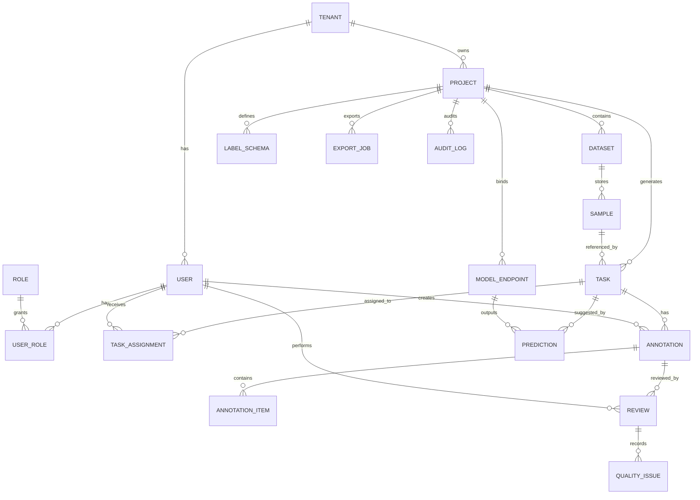

# 智能数据标注平台数据库表结构设计文档

版本：V1.0  
日期：2026-04-01  
数据库类型：PostgreSQL 15+  
适用范围：多租户智能数据标注平台（项目管理、任务流转、标注审核、模型协同、审计治理）

---

## 1. 设计目标

1. 支持多租户隔离与组织级权限管理。  
2. 支持多模态数据样本管理与任务分发。  
3. 支持标注、审核、质检、争议仲裁全流程。  
4. 支持模型预标注与结果回流闭环。  
5. 支持可审计、可追溯、可扩展的数据治理。

---

## 2. 逻辑模型（ER 图）



---

## 3. 命名规范与通用字段

### 3.1 命名规范

1. 表名：`snake_case`，使用单数语义（如 `project`、`task_assignment`）。  
2. 主键：统一使用 `bigint`（雪花 ID 或序列均可）。  
3. 外键：`<ref_table>_id`。  
4. 时间字段：`created_at`、`updated_at`（`timestamptz`）。  
5. 逻辑删除：`deleted_at`（可空）。

### 3.2 通用审计字段（建议所有核心表包含）

1. `created_by` bigint  
2. `updated_by` bigint  
3. `version` int（乐观锁）

---

## 4. 核心表结构

以下字段为推荐最小集，实际可按业务扩展。

### 4.1 租户与组织域

#### 表：`tenant`

| 字段 | 类型 | 约束 | 说明 |
|---|---|---|---|
| id | bigint | PK | 租户ID |
| code | varchar(64) | UK, not null | 租户编码 |
| name | varchar(128) | not null | 租户名称 |
| status | varchar(32) | not null | `active/suspended` |
| plan | varchar(32) | not null | 订阅计划 |
| created_at | timestamptz | not null | 创建时间 |
| updated_at | timestamptz | not null | 更新时间 |

索引建议：`uk_tenant_code(code)`。

#### 表：`user`

| 字段 | 类型 | 约束 | 说明 |
|---|---|---|---|
| id | bigint | PK | 用户ID |
| tenant_id | bigint | FK | 所属租户 |
| email | varchar(255) | not null | 邮箱 |
| name | varchar(128) | not null | 姓名 |
| status | varchar(32) | not null | `active/disabled` |
| last_login_at | timestamptz | null | 最近登录时间 |
| created_at | timestamptz | not null | 创建时间 |
| updated_at | timestamptz | not null | 更新时间 |

约束建议：`uk_user_tenant_email(tenant_id, email)`。

#### 表：`role`

| 字段 | 类型 | 约束 | 说明 |
|---|---|---|---|
| id | bigint | PK | 角色ID |
| tenant_id | bigint | FK | 所属租户 |
| role_key | varchar(64) | not null | 如 `admin/reviewer/annotator` |
| role_name | varchar(128) | not null | 角色名 |
| created_at | timestamptz | not null | 创建时间 |
| updated_at | timestamptz | not null | 更新时间 |

#### 表：`user_role`

| 字段 | 类型 | 约束 | 说明 |
|---|---|---|---|
| id | bigint | PK | 关系ID |
| tenant_id | bigint | FK | 所属租户 |
| user_id | bigint | FK | 用户ID |
| role_id | bigint | FK | 角色ID |
| created_at | timestamptz | not null | 创建时间 |

约束建议：`uk_user_role(tenant_id, user_id, role_id)`。

---

### 4.2 项目与数据域

#### 表：`project`

| 字段 | 类型 | 约束 | 说明 |
|---|---|---|---|
| id | bigint | PK | 项目ID |
| tenant_id | bigint | FK | 所属租户 |
| project_code | varchar(64) | not null | 项目编码 |
| name | varchar(128) | not null | 项目名称 |
| description | text | null | 项目描述 |
| modality | varchar(32) | not null | `text/image/audio/video/timeseries/multimodal` |
| status | varchar(32) | not null | `draft/running/archived` |
| owner_id | bigint | FK user(id) | 负责人 |
| created_at | timestamptz | not null | 创建时间 |
| updated_at | timestamptz | not null | 更新时间 |

约束建议：`uk_project_tenant_code(tenant_id, project_code)`。

#### 表：`dataset`

| 字段 | 类型 | 约束 | 说明 |
|---|---|---|---|
| id | bigint | PK | 数据集ID |
| tenant_id | bigint | FK | 所属租户 |
| project_id | bigint | FK | 项目ID |
| name | varchar(128) | not null | 数据集名称 |
| source_type | varchar(32) | not null | `upload/s3/gcs/api` |
| source_config | jsonb | null | 数据源配置（脱敏） |
| status | varchar(32) | not null | `active/frozen` |
| created_at | timestamptz | not null | 创建时间 |
| updated_at | timestamptz | not null | 更新时间 |

索引建议：`idx_dataset_project(project_id)`。

#### 表：`sample`

| 字段 | 类型 | 约束 | 说明 |
|---|---|---|---|
| id | bigint | PK | 样本ID |
| tenant_id | bigint | FK | 所属租户 |
| dataset_id | bigint | FK | 数据集ID |
| external_id | varchar(128) | null | 外部样本标识 |
| data_uri | text | not null | 样本地址 |
| data_hash | varchar(128) | null | 内容hash |
| metadata | jsonb | null | 元数据 |
| difficulty_score | numeric(5,4) | null | 难度分 |
| created_at | timestamptz | not null | 创建时间 |
| updated_at | timestamptz | not null | 更新时间 |

约束建议：`uk_sample_dataset_external(dataset_id, external_id)`（可选）。  
索引建议：`idx_sample_dataset(dataset_id)`、`idx_sample_metadata_gin using gin(metadata)`。

#### 表：`label_schema`

| 字段 | 类型 | 约束 | 说明 |
|---|---|---|---|
| id | bigint | PK | 配置ID |
| tenant_id | bigint | FK | 所属租户 |
| project_id | bigint | FK | 项目ID |
| version_no | int | not null | 版本号 |
| schema_json | jsonb | not null | 标注配置 |
| is_active | boolean | not null | 是否当前生效 |
| created_at | timestamptz | not null | 创建时间 |

约束建议：`uk_schema_project_version(project_id, version_no)`。

---

### 4.3 任务与分配域

#### 表：`task`

| 字段 | 类型 | 约束 | 说明 |
|---|---|---|---|
| id | bigint | PK | 任务ID |
| tenant_id | bigint | FK | 所属租户 |
| project_id | bigint | FK | 项目ID |
| sample_id | bigint | FK | 样本ID |
| schema_id | bigint | FK label_schema(id) | 使用的标注配置 |
| priority | int | not null default 100 | 优先级（越小越高） |
| status | varchar(32) | not null | `pending/assigned/in_progress/done/reviewing/rejected/closed` |
| due_at | timestamptz | null | 截止时间 |
| created_at | timestamptz | not null | 创建时间 |
| updated_at | timestamptz | not null | 更新时间 |

索引建议：
1. `idx_task_project_status(project_id, status)`  
2. `idx_task_priority_status(priority, status)`

#### 表：`task_assignment`

| 字段 | 类型 | 约束 | 说明 |
|---|---|---|---|
| id | bigint | PK | 分配ID |
| tenant_id | bigint | FK | 所属租户 |
| task_id | bigint | FK | 任务ID |
| assignee_id | bigint | FK user(id) | 执行人 |
| assign_type | varchar(32) | not null | `manual/auto/rule_based` |
| assigned_at | timestamptz | not null | 分配时间 |
| accepted_at | timestamptz | null | 接单时间 |
| completed_at | timestamptz | null | 完成时间 |
| status | varchar(32) | not null | `assigned/accepted/completed/cancelled` |

约束建议：`uk_assignment_task_user(task_id, assignee_id)`（按业务决定是否唯一）。

---

### 4.4 标注与审核域

#### 表：`annotation`

| 字段 | 类型 | 约束 | 说明 |
|---|---|---|---|
| id | bigint | PK | 标注ID |
| tenant_id | bigint | FK | 所属租户 |
| project_id | bigint | FK | 项目ID |
| task_id | bigint | FK | 任务ID |
| annotator_id | bigint | FK user(id) | 标注人 |
| source_type | varchar(32) | not null | `human/model/import` |
| quality_score | numeric(5,4) | null | 质量分 |
| status | varchar(32) | not null | `draft/submitted/approved/rejected` |
| submitted_at | timestamptz | null | 提交时间 |
| created_at | timestamptz | not null | 创建时间 |
| updated_at | timestamptz | not null | 更新时间 |

索引建议：`idx_annotation_task(task_id)`、`idx_annotation_annotator(annotator_id)`。

#### 表：`annotation_item`

| 字段 | 类型 | 约束 | 说明 |
|---|---|---|---|
| id | bigint | PK | 明细ID |
| tenant_id | bigint | FK | 所属租户 |
| annotation_id | bigint | FK | 标注ID |
| label_key | varchar(128) | not null | 标签键 |
| label_value | jsonb | not null | 标签值（结构化） |
| span_start | int | null | 文本起始位 |
| span_end | int | null | 文本结束位 |
| confidence | numeric(5,4) | null | 置信度 |
| created_at | timestamptz | not null | 创建时间 |

索引建议：`idx_ann_item_annotation(annotation_id)`、`idx_ann_item_value_gin using gin(label_value)`。

#### 表：`review`

| 字段 | 类型 | 约束 | 说明 |
|---|---|---|---|
| id | bigint | PK | 审核ID |
| tenant_id | bigint | FK | 所属租户 |
| project_id | bigint | FK | 项目ID |
| annotation_id | bigint | FK | 标注ID |
| reviewer_id | bigint | FK user(id) | 审核人 |
| result | varchar(32) | not null | `approved/rejected/rework` |
| score | numeric(5,4) | null | 审核分 |
| comment | text | null | 评语 |
| reviewed_at | timestamptz | not null | 审核时间 |
| created_at | timestamptz | not null | 创建时间 |

索引建议：`idx_review_annotation(annotation_id)`、`idx_review_reviewer(reviewer_id)`。

#### 表：`quality_issue`

| 字段 | 类型 | 约束 | 说明 |
|---|---|---|---|
| id | bigint | PK | 质量问题ID |
| tenant_id | bigint | FK | 所属租户 |
| project_id | bigint | FK | 项目ID |
| review_id | bigint | FK | 审核ID |
| issue_type | varchar(64) | not null | 问题类型 |
| severity | varchar(16) | not null | `low/medium/high/critical` |
| description | text | null | 问题描述 |
| status | varchar(32) | not null | `open/fixed/ignored` |
| created_at | timestamptz | not null | 创建时间 |
| updated_at | timestamptz | not null | 更新时间 |

索引建议：`idx_quality_project_status(project_id, status)`。

---

### 4.5 模型协同域

#### 表：`model_endpoint`

| 字段 | 类型 | 约束 | 说明 |
|---|---|---|---|
| id | bigint | PK | 模型端点ID |
| tenant_id | bigint | FK | 所属租户 |
| project_id | bigint | FK | 项目ID |
| name | varchar(128) | not null | 端点名称 |
| provider | varchar(64) | not null | 提供方 |
| endpoint_url | text | not null | 调用地址 |
| auth_type | varchar(32) | not null | `token/aksk/none` |
| auth_config | jsonb | null | 鉴权配置（加密存储） |
| status | varchar(32) | not null | `active/inactive` |
| created_at | timestamptz | not null | 创建时间 |
| updated_at | timestamptz | not null | 更新时间 |

#### 表：`prediction`

| 字段 | 类型 | 约束 | 说明 |
|---|---|---|---|
| id | bigint | PK | 预测ID |
| tenant_id | bigint | FK | 所属租户 |
| project_id | bigint | FK | 项目ID |
| task_id | bigint | FK | 任务ID |
| model_id | bigint | FK model_endpoint(id) | 模型端点 |
| output_json | jsonb | not null | 预测结果 |
| confidence | numeric(5,4) | null | 综合置信度 |
| latency_ms | int | null | 推理时延 |
| status | varchar(32) | not null | `success/failed` |
| created_at | timestamptz | not null | 创建时间 |

索引建议：`idx_prediction_task(task_id)`、`idx_prediction_model(model_id, created_at)`。

---

### 4.6 交付与审计域

#### 表：`export_job`

| 字段 | 类型 | 约束 | 说明 |
|---|---|---|---|
| id | bigint | PK | 导出任务ID |
| tenant_id | bigint | FK | 所属租户 |
| project_id | bigint | FK | 项目ID |
| requested_by | bigint | FK user(id) | 发起人 |
| export_format | varchar(32) | not null | `json/csv/coco/yolo/custom` |
| filter_json | jsonb | null | 导出过滤条件 |
| file_uri | text | null | 导出文件地址 |
| status | varchar(32) | not null | `pending/running/success/failed` |
| started_at | timestamptz | null | 开始时间 |
| finished_at | timestamptz | null | 结束时间 |
| created_at | timestamptz | not null | 创建时间 |

#### 表：`audit_log`

| 字段 | 类型 | 约束 | 说明 |
|---|---|---|---|
| id | bigint | PK | 日志ID |
| tenant_id | bigint | FK | 所属租户 |
| actor_id | bigint | FK user(id) | 操作人 |
| action | varchar(128) | not null | 操作动作 |
| resource_type | varchar(64) | not null | 资源类型 |
| resource_id | varchar(64) | not null | 资源ID |
| before_data | jsonb | null | 变更前 |
| after_data | jsonb | null | 变更后 |
| ip | varchar(64) | null | 来源IP |
| user_agent | text | null | 终端信息 |
| created_at | timestamptz | not null | 操作时间 |

索引建议：
1. `idx_audit_tenant_time(tenant_id, created_at desc)`  
2. `idx_audit_actor_time(actor_id, created_at desc)`  
3. `idx_audit_resource(resource_type, resource_id)`

---

## 5. 状态流转建议

### 5.1 任务状态 `task.status`

```text
pending -> assigned -> in_progress -> done -> reviewing -> closed
                           \-> rejected -> in_progress
```

### 5.2 标注状态 `annotation.status`

```text
draft -> submitted -> approved
                 \-> rejected -> draft
```

### 5.3 审核结果 `review.result`

1. `approved`：通过。  
2. `rejected`：驳回重做。  
3. `rework`：部分问题返修。

---

## 6. 索引与性能设计

1. 高频查询字段必须建立复合索引：`project_id + status`、`assignee_id + status`。  
2. JSON 场景建议 `GIN` 索引：`sample.metadata`、`annotation_item.label_value`。  
3. `audit_log` 建议按月分区（`range(created_at)`）。  
4. 大表分页禁止 `offset` 深翻页，采用基于游标（`id`/`created_at`）分页。  
5. 导出与统计类查询走异步任务，避免拖慢在线事务库。

---

## 7. 分库分表与容量规划建议

### 7.1 单库阶段（< 5亿 annotation_item）

1. 使用 PostgreSQL 主从架构。  
2. 读写分离，报表走只读副本。  
3. 关键表分区：`annotation_item`、`audit_log`。

### 7.2 水平扩展阶段

1. 按 `tenant_id` 或 `project_id` 进行逻辑分片。  
2. 对象存储与元数据分离（样本正文不上关系库）。  
3. 冷热数据分层：近 6 个月热数据在线，历史数据归档。

---

## 8. 数据安全与合规建议

1. 敏感配置（`auth_config`）加密存储。  
2. 用户隐私字段（邮箱、IP）可按合规要求脱敏。  
3. 所有跨租户查询必须显式带 `tenant_id` 条件。  
4. 审计日志不可物理更新（append-only）。  
5. 导出文件设置有效期与访问签名。

---

## 9. 迁移与版本管理

1. 采用迁移工具（如 Flyway/Liquibase/Alembic）管理 DDL。  
2. 约定版本号：`VYYYYMMDDNN__desc.sql`。  
3. 禁止在高峰期执行阻塞型 DDL。  
4. 字段变更遵循“先加后切再删”灰度原则。  
5. 重大变更必须附回滚脚本。

---

## 10. 最小可用 DDL 示例（节选）

```sql
create table tenant (
  id bigint primary key,
  code varchar(64) not null unique,
  name varchar(128) not null,
  status varchar(32) not null,
  plan varchar(32) not null,
  created_at timestamptz not null,
  updated_at timestamptz not null
);

create table project (
  id bigint primary key,
  tenant_id bigint not null references tenant(id),
  project_code varchar(64) not null,
  name varchar(128) not null,
  modality varchar(32) not null,
  status varchar(32) not null,
  owner_id bigint,
  created_at timestamptz not null,
  updated_at timestamptz not null,
  unique (tenant_id, project_code)
);

create index idx_project_tenant_status on project(tenant_id, status);
```

---

## 11. 评审清单

1. 表是否全部包含 `tenant_id`。  
2. 核心状态机是否有无效流转保护。  
3. 是否存在跨租户越权风险查询。  
4. 关键业务查询是否命中索引。  
5. 审计日志是否满足不可篡改要求。  
6. 扩容路径是否明确（分区/分片/归档）。

---

## 12. 后续扩展建议

1. 增加 `consensus_result` 表支持多标注员共识融合。  
2. 增加 `billing_usage` 表支持计量计费。  
3. 增加 `feature_flag` 表支持灰度发布。  
4. 增加 `data_lineage` 表支持样本血缘追踪。
