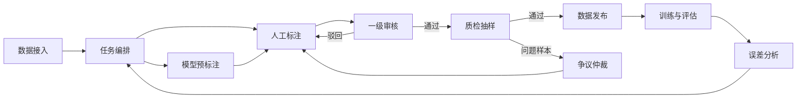
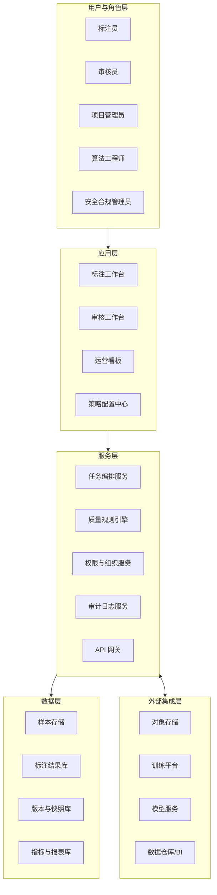
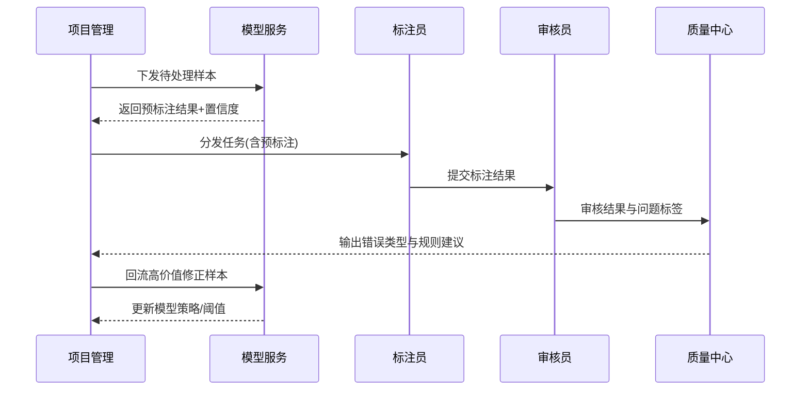
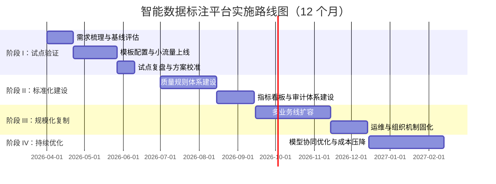

# 封面页

**《智能数据标注平台产品白皮书》**  
版本：V2.0（详细版）  
发布日期：2026 年 4 月 1 日  
文件属性：正式投递版  
建议密级：对外受控/内部敏感（按场景选择）  
提交对象：客户决策层、技术委员会、采购与合规团队、项目评审会

编制单位：________________  
联系人：________________  
邮箱：________________  
电话：________________

---

# 目录页

1. 执行摘要  
2. 行业背景与建设必要性  
3. 目标用户与应用场景  
4. 产品定位与价值主张  
5. 产品能力全景  
6. 端到端业务流程（图）  
7. 技术架构设计（图）  
8. 人机协同与数据闭环机制（图）  
9. 安全合规与治理体系  
10. 实施方法论与路线图（图）  
11. 商业价值与 ROI 模型  
12. 风险识别与应对策略  
13. 结论与合作建议  
14. 统一术语页  
15. 附录 A：指标口径  
16. 附录 B：实施清单

---

# 1. 执行摘要

智能化建设进入规模化阶段后，组织面临的关键问题不再是“是否有模型可用”，而是“能否持续、稳定、低成本地生产高质量训练与评估数据”。  
智能数据标注平台的核心使命，是将分散的人力、数据与工具能力整合为可治理、可迭代、可审计的数据生产系统。

本白皮书提出一套可落地的平台方案，覆盖：
1. 多模态数据标注与协同流程。  
2. 质量控制与一致性管理。  
3. 人机协同与模型回流机制。  
4. 权限审计与合规治理。  
5. 分阶段实施与可量化 ROI 评估。

---

# 2. 行业背景与建设必要性

## 2.1 行业变化

1. AI 应用从试点转向生产，数据环节成为瓶颈。  
2. 多模态场景快速增长，单点工具难以覆盖端到端流程。  
3. 合规要求提升，数据留存、权限审计、跨域流转管理成为采购前置条件。

## 2.2 典型痛点

1. 数据来源分散，任务编排依赖人工沟通。  
2. 标注标准不统一，返工率高，数据可信度不足。  
3. 模型与标注系统解耦，无法形成持续优化闭环。  
4. 缺少统一指标体系，管理层难以判断投入产出。  
5. 缺乏审计证据链，难通过安全与合规审查。

---

# 3. 目标用户与应用场景

## 3.1 目标用户

1. 业务负责人：关注交付周期、成本与业务结果。  
2. 算法团队：关注数据质量、样本覆盖与迭代效率。  
3. 数据团队：关注流程标准化与质量稳定性。  
4. 平台团队：关注系统集成、可扩展性与运维效率。  
5. 安全合规团队：关注权限、留痕、数据边界与风险控制。

## 3.2 重点场景

1. 文本：分类、抽取、问答、对话质检。  
2. 图像/视频：检测、分割、行为事件识别。  
3. 音频：转写、说话人识别、情感与意图标注。  
4. 时序：工业信号、IoT 异常、设备健康监测。  
5. 融合场景：文本+图像、音频+文本等跨模态任务。

---

# 4. 产品定位与价值主张

## 4.1 产品定位

智能数据标注平台是“数据生产与质量运营基础设施”，而不是单一标注工具。  
平台提供统一入口管理数据接入、任务分发、标注执行、质量复核、模型回流和结果交付。

## 4.2 价值主张

1. 更快：缩短从样本到可训练数据的周期。  
2. 更稳：通过标准、审核与指标体系稳定质量。  
3. 更省：通过预标注和主动学习减少纯人工成本。  
4. 更可管：通过权限、审计与策略实现治理闭环。  
5. 更可扩：通过 API 和插件化架构对接现有系统。

---

# 5. 产品能力全景

1. 数据接入中心：支持文件、对象存储、流式数据批次导入。  
2. 项目与任务管理：支持项目模板、批次分发、进度与 SLA 管理。  
3. 标注工作台：支持多模态、多类型标注控件与模板复用。  
4. 审核工作台：支持多级审核、抽检、争议样本仲裁。  
5. 质量中心：支持一致性评估、错误分布分析、返工闭环。  
6. 模型协同中心：支持预标注、样本优先级排序、结果回流。  
7. 集成与开放接口：支持与训练平台、仓库、报表系统联通。  
8. 安全治理中心：权限、审计、留存策略和合规导出。

---

# 6. 端到端业务流程（图）

说明：该流程体现“任务执行闭环 + 质量闭环 + 模型闭环”三层联动。

---

# 7. 技术架构设计（图）

设计原则：高内聚、低耦合、可扩展、可审计、可观测。

---

# 8. 人机协同与数据闭环机制（图）

协同要点：
1. 低置信度样本优先进入人工复核。  
2. 高频错误类型进入规则修复与模板优化。  
3. 回流样本按“价值优先级”进入下一轮训练。

---

# 9. 安全合规与治理体系

## 9.1 权限与访问控制

1. 基于角色的最小权限策略。  
2. 项目级、数据集级、操作级三层授权。  
3. 关键操作二次确认与审批流控制。

## 9.2 数据治理策略

1. 数据分类分级与访问边界控制。  
2. 全链路加密（传输/存储）。  
3. 留存与销毁策略可配置。  
4. 脱敏与匿名化处理策略。

## 9.3 审计与可追溯

1. 全量记录关键操作日志。  
2. 支持操作人、时间、对象、变更前后对比。  
3. 支持导出审计证据包用于内外部审查。

## 9.4 合规落地建议

1. 在项目前期完成安全评估与风险分级。  
2. 在试点阶段固化审计规则与报表模板。  
3. 在规模化阶段建立例行审查与异常处置流程。

---

# 10. 实施方法论与路线图（图）

## 10.1 实施方法论

1. 先试点：选高价值、可量化场景快速验证。  
2. 再标准化：固化模板、流程与指标口径。  
3. 后规模化：复制到多团队、多业务线。  
4. 持续优化：按季度迭代规则、模型与组织协同机制。

## 10.2 路线图

---

# 11. 商业价值与 ROI 模型

## 11.1 成本侧收益

1. 人工标注工时下降。  
2. 返工与沟通成本下降。  
3. 重复采集与重复标注成本下降。

## 11.2 效率侧收益

1. 交付周期缩短。  
2. 样本周转率提升。  
3. 多团队协同效率提升。

## 11.3 质量侧收益

1. 首次通过率提升。  
2. 一致性指标提升。  
3. 模型评估数据稳定性提升。

## 11.4 ROI 建议公式

1. 年化收益 = 成本节约 + 效率增益折算 + 质量增益折算。  
2. ROI = （年化收益 - 年化总投入）/ 年化总投入。  
3. 回本周期（月）= 项目总投入 / 月度净收益。

---

# 12. 风险识别与应对策略

1. 范围膨胀风险：采用里程碑范围冻结机制。  
2. 标准不一致风险：建立样本标准库与审核准则。  
3. 协同风险：采用 RACI 机制与固定节奏评审。  
4. 质量波动风险：建立抽检规则与异常告警阈值。  
5. 合规风险：前置安全评估，分阶段放量上线。  
6. 成本失控风险：持续监控单位样本成本与资源利用率。

---

# 13. 结论与合作建议

智能数据标注平台的建设价值，不在于替代单个工具，而在于建立“数据生产系统能力”。  
建议组织采用“试点验证—标准化—规模化—持续优化”的路径推进，通过统一流程、统一指标、统一治理，实现可持续的 AI 数据供给能力。

---

# 14. 统一术语页

| 术语 | 定义 | 管理意义 |
|---|---|---|
| 数据标注 | 对原始样本添加结构化语义信息 | 训练与评估数据基础 |
| 标注模板 | 可复用的任务配置规则 | 缩短新场景上线周期 |
| 预标注 | 模型先输出初始标签供人工修订 | 提升人效、降低成本 |
| 主动学习 | 按价值优先分配样本处理顺序 | 提升单位样本价值 |
| 一致性指标 | 多标注员对同一任务结果的一致程度 | 评估标准稳定性 |
| 返工率 | 审核驳回后需重做样本占比 | 反映流程成熟度 |
| 数据闭环 | 标注结果回流模型并驱动下一轮任务 | 支撑持续优化 |
| 审计日志 | 关键操作全链路留痕记录 | 支撑合规与问责 |
| RACI | 责任分工模型 | 提升跨团队执行效率 |
| SLA | 服务级别承诺 | 保障交付与服务质量 |

---

# 15. 附录 A：指标口径

## A.1 效率指标

1. 平均标注时长（秒/样本）= 总标注耗时 / 样本量。  
2. 单人日产能（样本/人天）= 日完成样本 / 人天投入。  
3. 任务交付周期（天）= 创建至业务验收自然日。

## A.2 质量指标

1. 首次通过率 = 一次审核通过样本 / 审核总样本。  
2. 返工率 = 驳回样本 / 标注总样本。  
3. 一致性得分 = 双盲一致样本 / 双盲样本总量。  
4. 缺陷密度 = 质量问题样本 / 千样本。

## A.3 治理指标

1. 审计覆盖率 = 有审计记录关键操作 / 关键操作总数。  
2. 权限合规率 = 符合最小权限策略账号 / 账号总数。  
3. 异常闭环时效 = 异常发现到处置完成平均时长。

## A.4 经营指标

1. 单位样本成本 = 项目总成本 / 有效样本总数。  
2. 人机协同贡献率 = 预标注修订样本 / 总样本。  
3. 回本周期 = 总投入 / 月度净收益。

---

# 16. 附录 B：实施清单

## B.1 项目启动清单

1. 明确业务目标、范围、边界和成功标准。  
2. 明确项目组织、职责与升级路径。  
3. 建立基线数据（效率/质量/成本）。  
4. 完成安全与合规前置评估。

## B.2 试点执行清单

1. 完成模板配置与样本分层策略。  
2. 完成角色授权与流程联调。  
3. 建立抽检规则与争议处理机制。  
4. 输出周报与阶段复盘结论。

## B.3 规模化推广清单

1. 完成多业务线复制计划与节奏。  
2. 完成平台监控告警与容量规划。  
3. 完成培训体系和操作手册。  
4. 建立季度优化机制与责任人台账。

## B.4 投递前检查清单

1. 封面信息、密级、联系人是否完整。  
2. 指标口径是否与经营报表一致。  
3. 图表是否可渲染、编号是否正确。  
4. 对外版本是否完成法务/合规审阅。
